<p align="center">
  <h1>API Marvel</h1>
</p>

# Introducción

Desarrollo de reto técnico "Práctica REST API y
Contenedores" para participar por puesto dentro de la empresa SPS

## Descripción de los pasos realizados

### 1 Creación del proyecto utilizando framework nest
```bash
#Instalacion de nest
$ npm i -g @nestjs/cli

#creación del proyecto
$ nest new api-marvel
```
### 2 definición del puerto solicitado 8090
en el archivo ./src/main.ts se define la variable y se le asigna el valor 8090, posteriormente se asigna la variable port dentro de la funcion listen del objeto app
```js
const port = 8090;
...
await app.listen(port);
```

### 3 primer commit 
```bash
$ git add .

$ git commit -m "first commit"
```

### 4 Creación del controlador characters y del servicio marvel-api
```bash
#controller
$ nest generate controller characters
#service
$ nest generate service marvel-api
```

### 5 Instalación de @nestjs/axios y axios

```bash
$ npm i --save @nestjs/axios axios
```

### 6 Instalación de dotenv que permite importar las variables de entorno

```bash
$ npm install dotenv
```

### 7 creación de los archivos *.env* y *.env.example* 

- .env contiene las llaves del proyecto para poder consumir la API de Marvel

- .env.example contiene un ejemplo de como deberían definirse estas variables


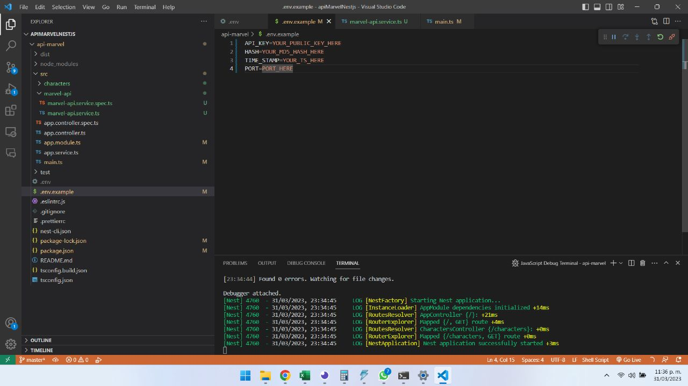

### 8 Importar variable de entorno 
asignar la variable de entorno PORT a la variable port en el archivo ./src/main.ts2 

```js
//importar dotenv 
import * as dotenv from 'dotenv';
dotenv.config();
//asignar nuevo valor a la variable port
//por default el puerto seguira siendo 8090 en caso de no encontrar la variable de entorno
const port = process.env.PORT || 8090;
```

### 9 configurar marvel service

repetir procedimiento de importacion de dotenv  
- se crea la variable privada auth que contiene las variables ts, apikey y hash mismas que serán enviadas en cada solicitud hacía la API externa de Marvel

- se define la funcion getData que devuelve una promesa despues de realizar un request 

- se define un objeto options que contiene el host y el path donde se concatena la variable auth para obtener los permisos de consulta de la API

- se resuelve la promesa y se devuelve un objeto con la respuesta, adicionalmente se manejan los errores y se devuelven con reject 

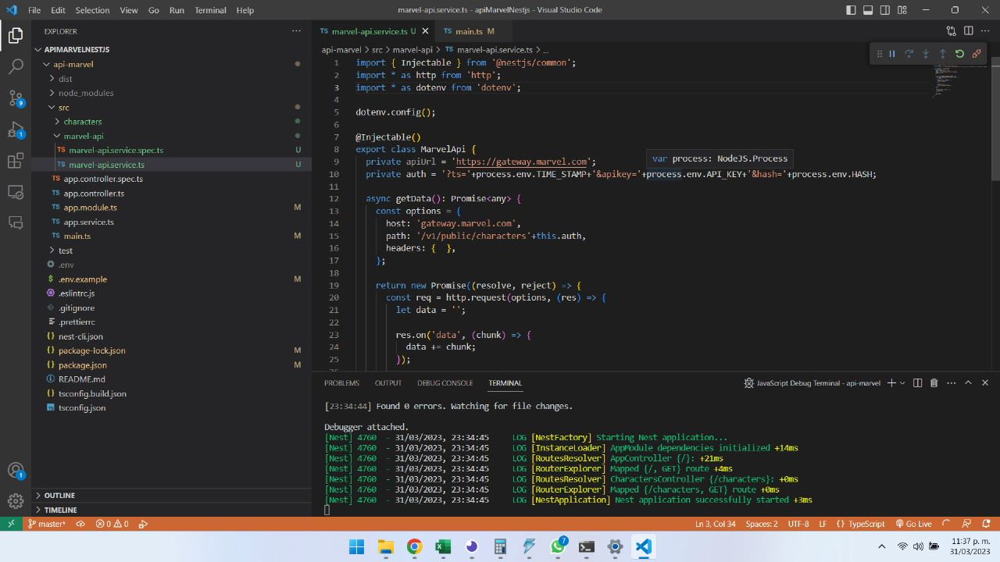

### 10 definir el primer endpoint

- se define dentro de marvel controller la funcion findAll que ejecuta a service getData 

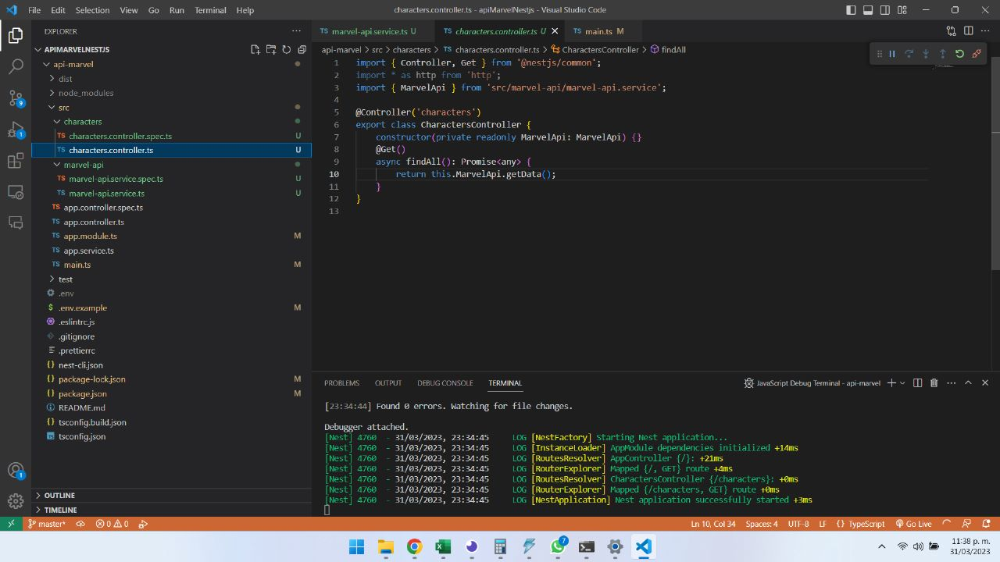

### 11 agregar el servicio en app.module

- se importa el servicio con el nombre MarvelApi y se define en los providers de @Module

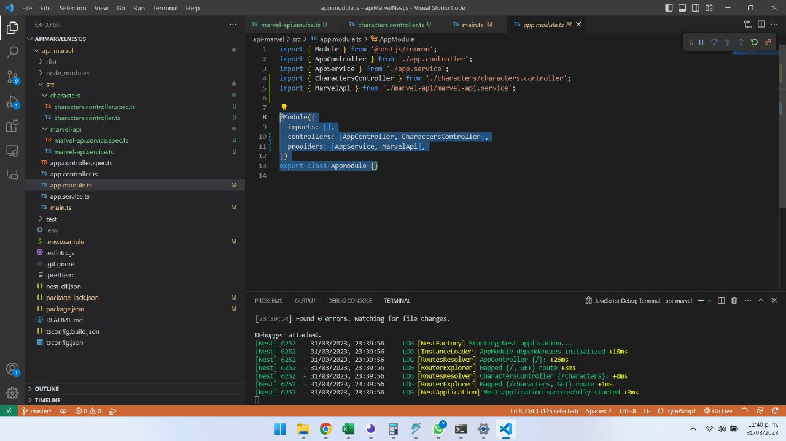

### 12 comprobar funcionalidad

- se levanta el servidor local

```bash
$ npm run start:dev
```

- se visita el endpoint characters para comprobar que funciona

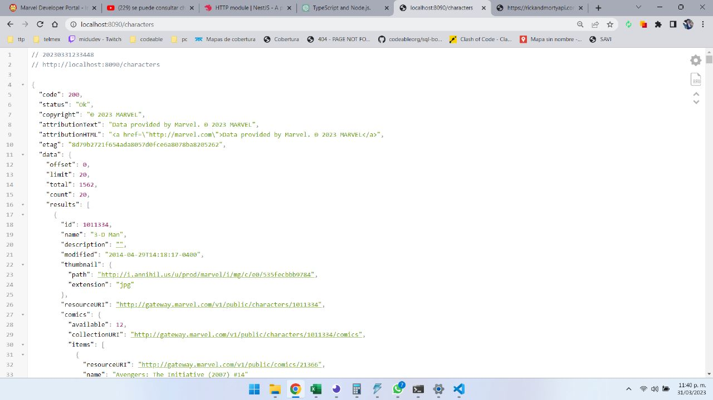

## Realizar commit

```bash
...
$ git commit -m "add service and characters controller"
```

## 13 Renombrar controlador

***Importante: Cambiar nombre del controllador en app.module***

- Si bien se podría crear un controlador para cada endpoint, no exite la necesidad para este proyecto en particular ya que todas las peticiones serán enviadas al mismo serivcio, por lo tanto characters.controller sera renombrado como marvel.controller.

- Adicionalmente en el nuevo marvel.controller 

  - se define que la ruta para el controlador será api/v1/:endpoint

  - se modifica la funcion findAll para recibir el parametro :endpoint y mandarlo a MarvelApi

  - se crea una segunda funcion para recibir y enviar el parametro :id encaso de que exista

  - se crea una tercera funcion para recibir y enviar tanto parametro :id como el :item en caso de que existan.


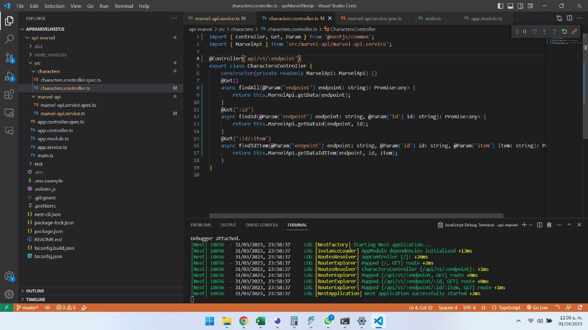

## 14 Comprobar y respaldar

una vez comprobado que continua funcionado proceder a realizar nuevo commit 

```bash
...
$ git commit -m "Replace characters.controller to Marvel controller"
```

## 15 Enviar querys a la API externa

- Dentro de marvel-api.service.ts se crea la función que dará el formato de url a los parametros enviados en la url

- Se modifica el objeto options dentro de las 3 funciones para recibir un nuevo parametro queryParams enviar la solicitud completa en path

```js

export class MarvelApi {
...
  private queryFormat(params: object): String {
    let query = [];
    for(let k in params){
      query.push(`${k}=${params[k]}`);
    }
    return query.join("&");
  }
...
  async getData(queryParams: any, endpoint: string): Promise<any> {
    const options = {
      host: 'gateway.marvel.com',
      path: '/v1/public/'+endpoint+''+this.auth+'&'+this.queryFormat(queryParams),
      headers: {  },
    };
...

```

- Se modifica el controlador para enviar y recibir el query ingresado por el usuario

```js
...
async findAll(@Query() queryParams: any, @Param('endpoint') endpoint: string): Promise<any> {
    return this.MarvelApi.getData(queryParams, endpoint);
}
...
```

## 16 comprobar y respaldar
En este punto ya debemos poder visitar diferentes endpoints y enviar parametros en el query  

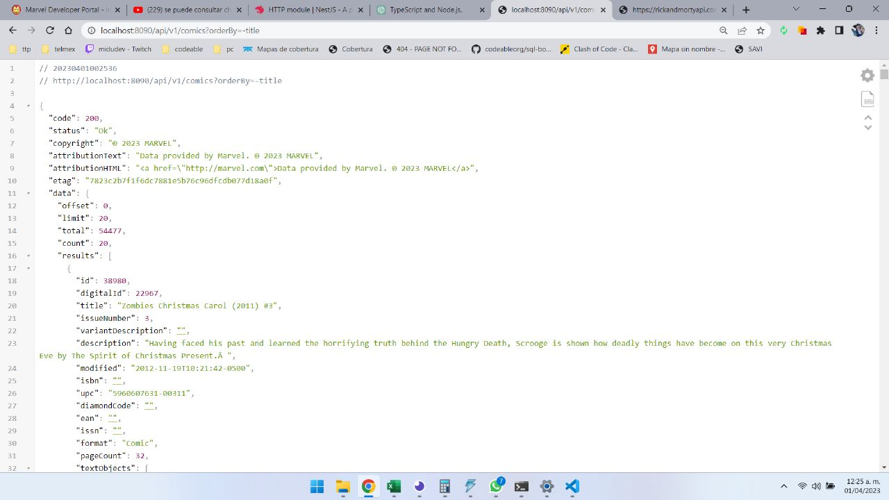

```bash
...
$ git commit -m "api funcional"

```

## 17 Modificar el app.controller

A manera de página de bienvenida, agregar links para los endpoints characters, health y api-doc

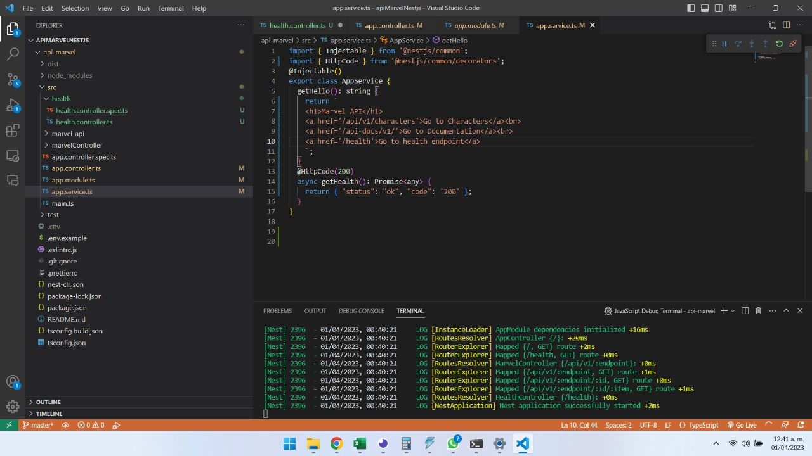

## 18 crear el endpoint health

app.controller.ts

```js
@Get('health')
async getHealth(): Promise<object> {
  return await this.appService.getHealth();
}
```

app.service.ts
```js
@HttpCode(200)
async getHealth(): Promise<any> {
  return { "status": "ok", "code": '200' };
}
```

## 19 pruebas desde insomnia

Comprobar que diferentes endpoints enviando diferentes parametros

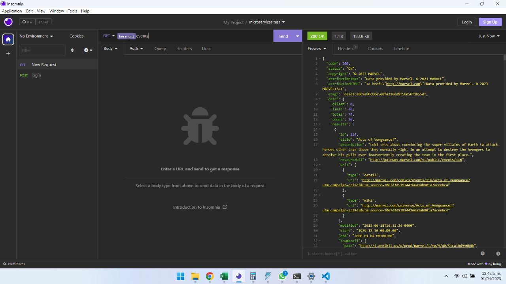

## 20 Documentar la API

Instalar swagger
```bash
$ npm i @nestjs/swagger swagger-ui-express 
```

agregar swagger en main.ts y definir la ruta api-docs/v1

```js
import { DocumentBuilder, SwaggerModule } from '@nestjs/swagger';

const options = new DocumentBuilder()
.setTitle("Api Marvel")
.setDescription("Api Marvel complete documentation go to <a href='https://developer.marvel.com/docs'>https://developer.marvel.com/docs</a>")
.setVersion("1.0")
.addTag("marvel")
.build();

const document = SwaggerModule.createDocument(app, options);

SwaggerModule.setup('api-docs/v1', app, document);

```

por temas de tiempo solo se indican 3 parametros generales para enviar desde los test en la documentación. Quedará pendiente para una segunda versión el crear una documentación completa que permita enviar parametros segun sea el endopoint

marvel.controller.ts
```js
@ApiQuery({ required: false, name: 'orderBy', type: 'string', description: 'Order the result set by a field or fields. Add a "-" to the value sort in descending order. Multiple values are given priority in the order in which they are passed.' })
@ApiQuery({ required: false, name: 'limit', type: 'integer', description: 'Limit the result set to the specified number of resources.' })
@ApiQuery({ required: false, name: 'offset', type: 'string', description: 'Skip the specified number of resources in the result set.' })
  
```

con estas modificaciones se renderiza correctamente el endpoint de documentación

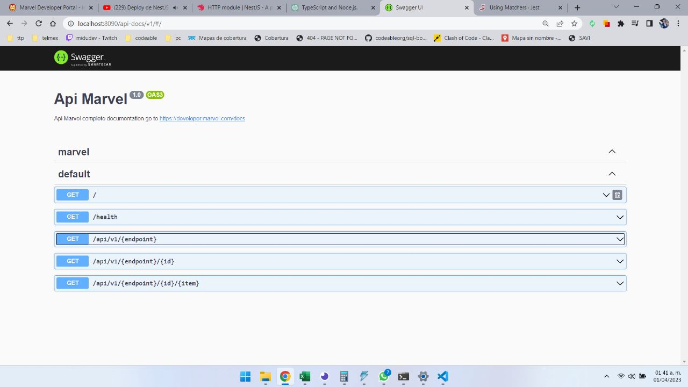

## 21 Deploy en heroku

- Crear archivo Procfile

Procfile
```bash
web: npm run start:prod
```

- Commit final

```bash
$ git add .
$ git commit -m "ready to production"
```

- Login en heroku y creación del repositorio remoto, seguir las instrucciones de la documentación oficial de heroku para subir la API

```bash
$ heroku login

$ heroku create

# subir la aplicacion a heroku
$ git push heroku master
```

- Crear las variables de entorno en heroku

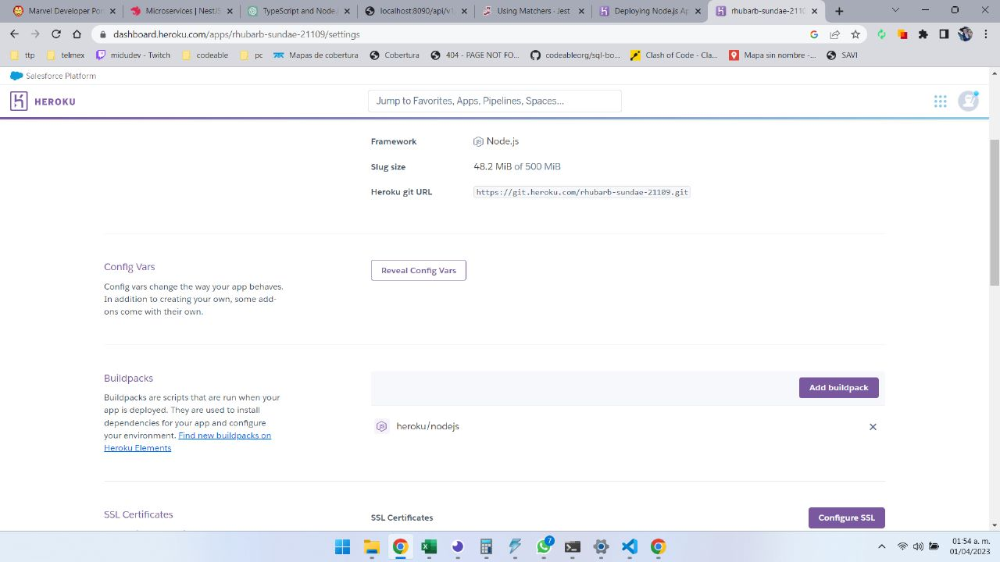

- Comprobar que funciona la [API](https://rhubarb-sundae-21109.herokuapp.com/)

pantalla principal [API](https://rhubarb-sundae-21109.herokuapp.com/)

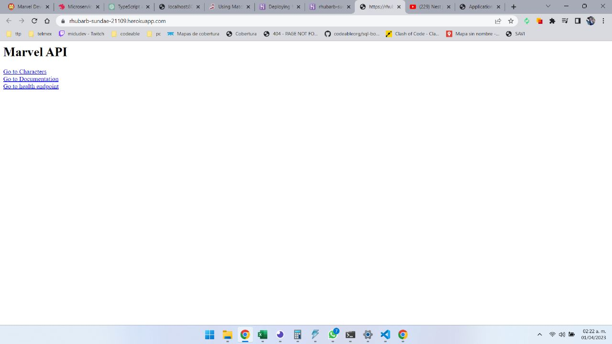

documentacion [API](https://rhubarb-sundae-21109.herokuapp.com/api-docs/v1)

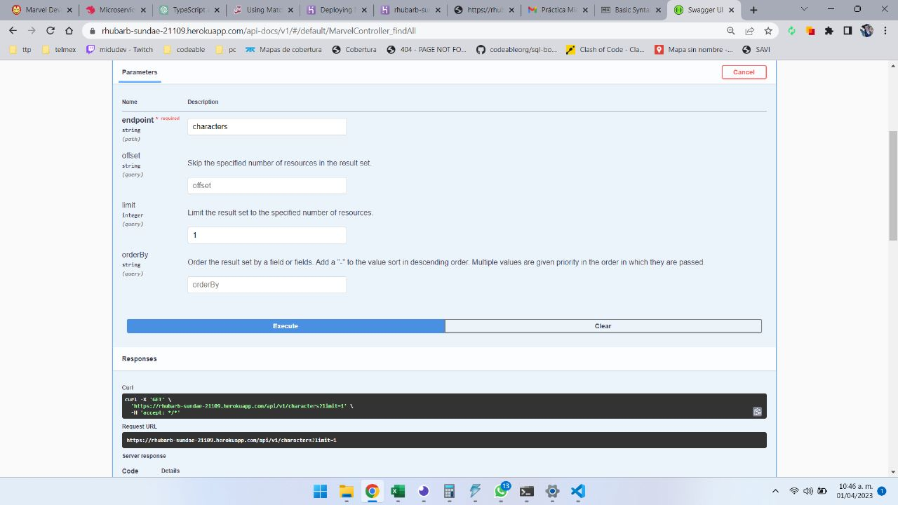

endpoint characters [API](https://rhubarb-sundae-21109.herokuapp.com/api/v1/characters)

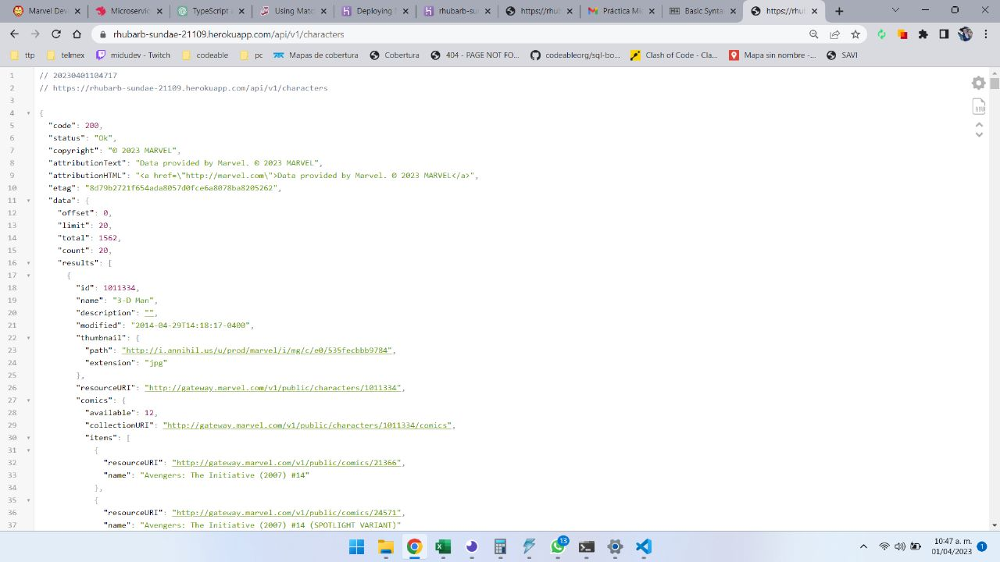

health endpoint  [API](https://rhubarb-sundae-21109.herokuapp.com/health)

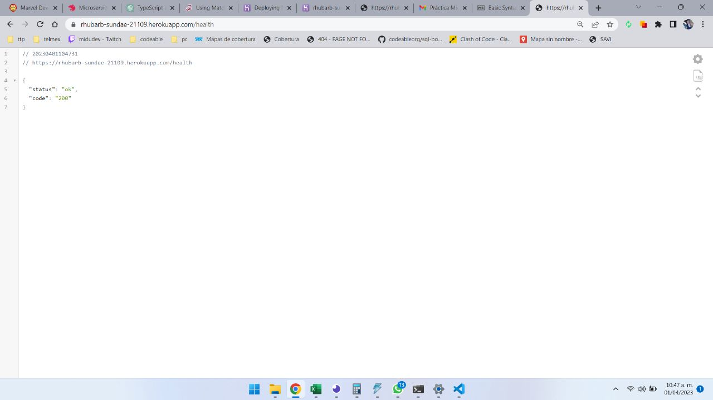

# Agradecimientos

Es la primera ocasión que utilizo TypeScript, nest, swagger y que trabajo con microservicios, previo a la prueba técnica realice un ejercicio con javaScript a modo de entender el ejercicio. Una vez que logré entender los conceptos basicos decidí buscar un framework y encontré nest el cual me permitió realizar el proyecto en un par de horas.  Aprovecho para agradecer a [Codeable](https://www.codeable.la/) y todo el profesional equipo que lo conforma.

Agradezco enormemente la oportunidad de participar y poder realizar esta prueba técnica ya que en el proceso aprendí bastante y estoy seguro que el solo hecho de desarrollar este ejercicio ha sumado bastante a mi base de conocimientos.

Espero poder formar parte de su equipo, me encuentro muy emocionado de continuar con el proceso.

